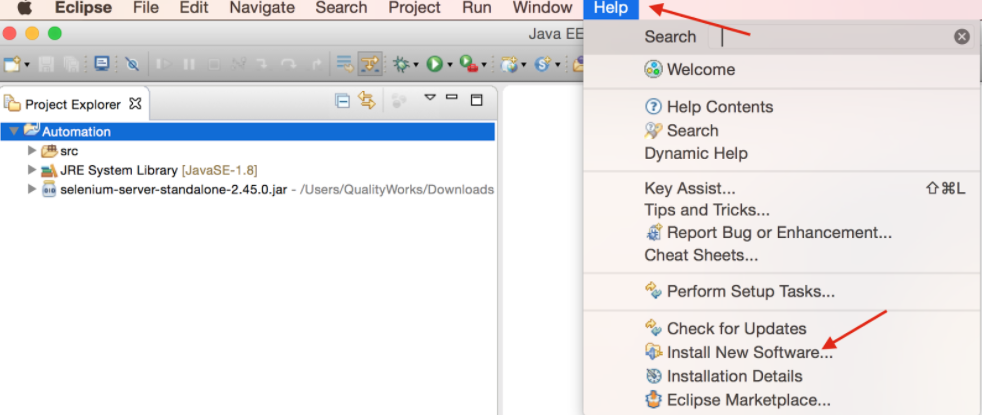
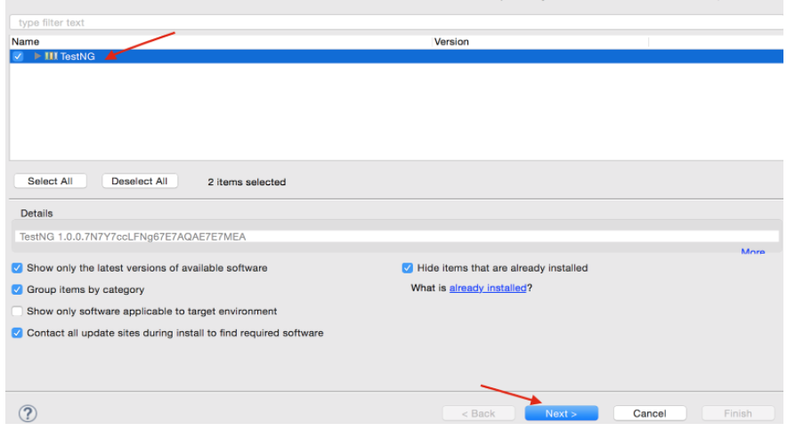
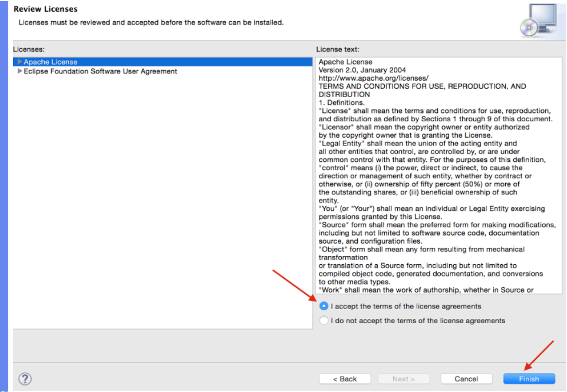
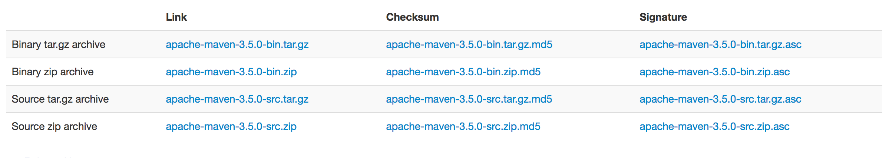
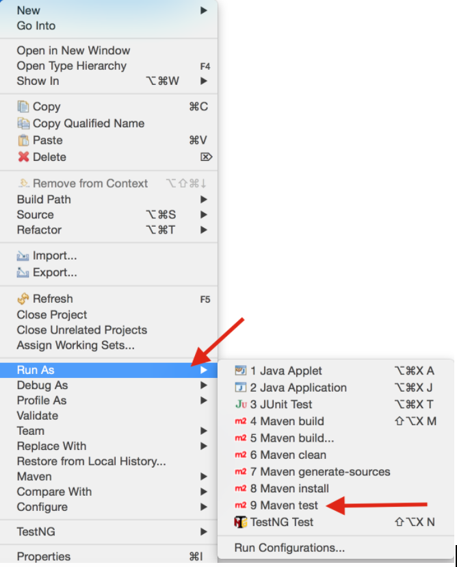
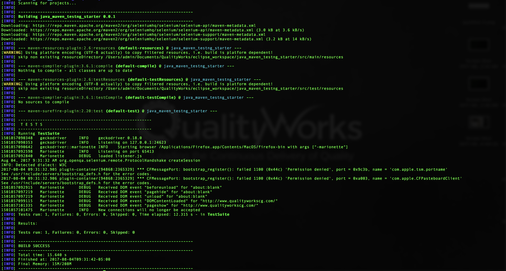

# Java Maven TestNG Automation Starter

This is a simple project that would allow anyone to get up and running with Java, Maven, Selenium and TestNG. It also explains how to execute a simple test that will assert the title of a page.

Currently the project has one test that will navigate to `http://www.qualityworkscg.com/` and verify the title matches `QualityWorks Consulting Group`

## Table of Contents
There are a few things we need before running the tests. These are:

1. [Java Installation / Update](#installation)
1. [Setting up Eclipse](#eclipse-setup)
    
    *  [Installing TestNG](#eclipse-testng-installation)
    *  [Setting up Maven](#setting-up-maven)
1. [Running the Project](#running-the-project)
    
    * [From Eclipse](#from-eclipse)
    * [From Terminal](#from-command-line)
1. [Special Notes](#special-notes)


## <a id="eclipse-setup"></a>Java Installation / Update

Check your system to see if you have the latest Java version installed.
 
 Command:
 ```shell
$ java -version
```

If you do not have the latest Java installed, find out how to install Java [here](https://www.java.com/en/download/help/download_options.xml).

Ensure your `JAVA_HOME` environment to the location of the installed JDK. Find out how to do that [here](https://docs.oracle.com/cd/E19182-01/820-7851/inst_cli_jdk_javahome_t/).

##  <a id="installation"></a> Setting up Eclipse

Navigate to the [Eclipse download page](https://eclipse.org/downloads/) and download eclipse for Java EE developers.

### <a id="eclipse-testng-installation"></a> Installing TestNG

1. Installing a Plugin:
    * Inside Eclipse, click on the **Help** menu  
    * Select **Install New Software**.

    

1. Locating the Plugin:
    * Click the **Add** button
    * Enter **http://beust.com/eclipse** in the **Location** field

    

1. Selecting the Plugin:
    * Ensure the **TestNG** checkbox is selected
    * Click the "Next" button to the right bottom

      


1. Finishing up:
    * Accept the terms of the license agreement
    * Click on the Finish button

    

### <a id="setting-up-maven"></a>Setting up Maven

1. Download Maven [here](https://maven.apache.org/download.cgi).

    

1. Unzip the distribution archive to the directory you wish to install Maven. I extracted maven to my `Documents` folder
  
1. Add Maven to the `PATH`. More information can be found in the `README.txt` in the zip folder.

    * Here's an example of how I added Maven to my `PATH` on MacOS.
    I added the folowing to the `~/.bash_profile`.

    ```shell
    $ export PATH=/Users/admin/Documents/Software/apache-maven-3.5.0/bin:$PATH

    ```
    * Then `source`d (execute) the content of the `~/.bash_profile`
      
    ``` shell 
    $ source ~/.bash_profile
    ```

1. Verify Maven was correctly installed

    * Command:

    ```shell
    $ mvn –version
    ```

    Maven dependencies are crucial to running any Maven project.
    
    Maven dependencies contains key references to libraries that a Maven project needs to execute. The `pom.xml` in the root of a Maven project file stores the dependencies (similar to the `package.json` for Node and `gemfile` for Ruby) for a project.

## <a id="running-the-project"></a> Running the Project

### <a id="from-eclipse"></a> From Eclipse

  1. Import this project into Eclispe
  1. Right click the project then select **Run As** then **Maven Tests**
  
  * 

    Following the above steps executes the configurations found in the `testing.xml` file by default.

### <a id="from-command-line"></a> From the Command Line

Navigate to the location of project then execute `mvn test`.

Expected output:



### <a id="special-notes"></a> Special Notes

* Ensure FF version 48 or higher is installed

## Contributing
Feel free to submit a pull requests! For specifics on how to contribute to this project, check out the  [contributing file](CONTRIBUTING.md).

## License
This project is released under the [MIT License](LICENSE).